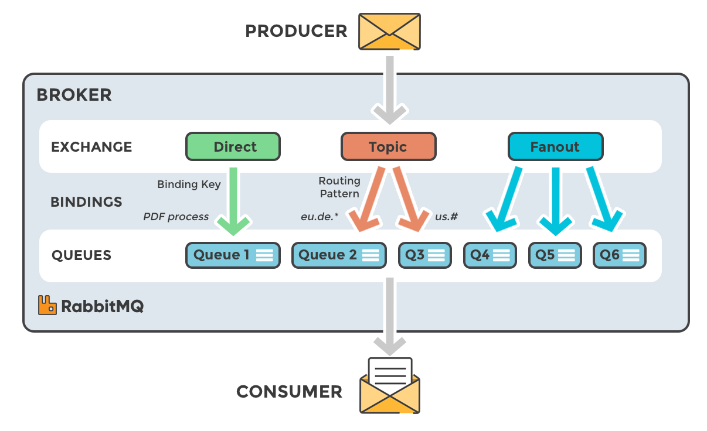

- Spring Boot
- RabbitMQ


------------

Start the community Docker image (for RabbitMQ 3.9, the latest series):
```
docker run -it --rm --name rabbitmq -p 5672:5672 -p 15672:15672 rabbitmq:3.9-management
```

------------
DEFAULT_EXCHANGE:
```
curl --location --request POST 'localhost:8080/emit/1' \
--header 'Content-Type: application/json' \
--data-raw '{
    "message": "Hello, world!",
    "key": ""
}'
```
```
INFO 10769 --- [enerContainer-1] com.kotlin.rabbitmqdemo.RabbitConfig     : simple.queue: (Body:'Hello, world!' MessageProperties [headers={}, contentType=text/plain, contentEncoding=UTF-8, contentLength=0, receivedDeliveryMode=PERSISTENT, priority=0, redelivered=false, receivedExchange=, receivedRoutingKey=simple.queue, deliveryTag=1, consumerTag=amq.ctag-Vfnyr7McYR66HwFAmlWvNw, consumerQueue=simple.queue])
```

FANOUT EXCHANGE:
```
curl --location --request POST 'localhost:8080/emit/2' \
--header 'Content-Type: application/json' \
--data-raw '{
    "message": "Hello, world!",
    "key": "any key"
}'
```

```
INFO 7868 --- [ntContainer#3-1] c.k.rabbitmqdemo.RabbitFanoutListener    : received object: MessageDto(message=Hello, world!, key=any key)
INFO 7868 --- [ntContainer#2-1] c.k.rabbitmqdemo.RabbitFanoutListener    : received object: MessageDto(message=Hello, world!, key=any key)
INFO 7868 --- [ntContainer#3-1] c.k.rabbitmqdemo.RabbitFanoutListener    : fanout.queue.2: (Body:'{"message":"Hello, world!","key":"any key"}' MessageProperties [headers={}, contentType=text/plain, contentEncoding=UTF-8, contentLength=0, receivedDeliveryMode=PERSISTENT, priority=0, redelivered=false, receivedExchange=common.exchange, receivedRoutingKey=, deliveryTag=2, consumerTag=amq.ctag-HfD7SgmFKn2QPQD4IH847A, consumerQueue=fanout.queue.2])
INFO 7868 --- [ntContainer#2-1] c.k.rabbitmqdemo.RabbitFanoutListener    : fanout.queue.1: (Body:'{"message":"Hello, world!","key":"any key"}' MessageProperties [headers={}, contentType=text/plain, contentEncoding=UTF-8, contentLength=0, receivedDeliveryMode=PERSISTENT, priority=0, redelivered=false, receivedExchange=common.exchange, receivedRoutingKey=, deliveryTag=2, consumerTag=amq.ctag-2G149QxYv9ctRoeqhZ0ZHA, consumerQueue=fanout.queue.1])
```

DIRECT EXCHANGE:
```
curl --location --request POST 'localhost:8080/emit/3' \
--header 'Content-Type: application/json' \
--data-raw '{
    "message": "Mesage with success",
    "key": "success"
}'

curl --location --request POST 'localhost:8080/emit/3' \
--header 'Content-Type: application/json' \
--data-raw '{
    "message": "Mesage with warning",
    "key": "warning"
}'

curl --location --request POST 'localhost:8080/emit/3' \
--header 'Content-Type: application/json' \
--data-raw '{
    "message": "Mesage with error",
    "key": "error"
}'

```

```
INFO 10769 --- [ntContainer#0-1] c.k.rabbitmqdemo.RabbitDirectListener    : direct.queue.success: (Body:'Mesage with success' MessageProperties [headers={}, contentType=text/plain, contentEncoding=UTF-8, contentLength=0, receivedDeliveryMode=PERSISTENT, priority=0, redelivered=false, receivedExchange=direct.exchange, receivedRoutingKey=success, deliveryTag=3, consumerTag=amq.ctag-SnXvZvfadm8RTliUweeqEw, consumerQueue=direct.queue.success])

INFO 10769 --- [ntContainer#0-1] c.k.rabbitmqdemo.RabbitDirectListener    : direct.queue.success: (Body:'Mesage with warning' MessageProperties [headers={}, contentType=text/plain, contentEncoding=UTF-8, contentLength=0, receivedDeliveryMode=PERSISTENT, priority=0, redelivered=false, receivedExchange=direct.exchange, receivedRoutingKey=warning, deliveryTag=4, consumerTag=amq.ctag-SnXvZvfadm8RTliUweeqEw, consumerQueue=direct.queue.success])

INFO 10769 --- [ntContainer#1-1] c.k.rabbitmqdemo.RabbitDirectListener    : direct.queue.error: (Body:'Mesage with error' MessageProperties [headers={}, contentType=text/plain, contentEncoding=UTF-8, contentLength=0, receivedDeliveryMode=PERSISTENT, priority=0, redelivered=false, receivedExchange=direct.exchange, receivedRoutingKey=error, deliveryTag=1, consumerTag=amq.ctag-0791uvjZVnrG1zI9V-rZDQ, consumerQueue=direct.queue.error])
```

TOPIC EXCHANGE:
```
curl --location --request POST 'localhost:8080/emit/4' \
--header 'Content-Type: application/json' \
--data-raw '{
    "message": "Mesage with one",
    "key": "one.abrakadabra"
}'

curl --location --request POST 'localhost:8080/emit/4' \
--header 'Content-Type: application/json' \
--data-raw '{
    "message": "Mesage with second",
    "key": "abrakadabra.second"
}'

curl --location --request POST 'localhost:8080/emit/4' \
--header 'Content-Type: application/json' \
--data-raw '{
    "message": "Mesage with one and second",
    "key": "one.second"
}'
```


```
INFO 10769 --- [ntContainer#4-1] c.k.rabbitmqdemo.RabbitTopicListener     : direct.queue.one: (Body:'Mesage with one' MessageProperties [headers={}, contentType=text/plain, contentEncoding=UTF-8, contentLength=0, receivedDeliveryMode=PERSISTENT, priority=0, redelivered=false, receivedExchange=topic.exchange, receivedRoutingKey=one.abrakadabra, deliveryTag=1, consumerTag=amq.ctag-JbfH0woTKR66mzuBfu6yOQ, consumerQueue=direct.queue.one])

INFO 10769 --- [ntContainer#5-1] c.k.rabbitmqdemo.RabbitTopicListener     : direct.queue.second: (Body:'Mesage with second' MessageProperties [headers={}, contentType=text/plain, contentEncoding=UTF-8, contentLength=0, receivedDeliveryMode=PERSISTENT, priority=0, redelivered=false, receivedExchange=topic.exchange, receivedRoutingKey=abrakadabra.second, deliveryTag=1, consumerTag=amq.ctag--cLKywPC0lBd8hHMOg0onQ, consumerQueue=direct.queue.second])

INFO 10769 --- [ntContainer#4-1] c.k.rabbitmqdemo.RabbitTopicListener     : direct.queue.one: (Body:'Mesage with one and second' MessageProperties [headers={}, contentType=text/plain, contentEncoding=UTF-8, contentLength=0, receivedDeliveryMode=PERSISTENT, priority=0, redelivered=false, receivedExchange=topic.exchange, receivedRoutingKey=one.second, deliveryTag=2, consumerTag=amq.ctag-JbfH0woTKR66mzuBfu6yOQ, consumerQueue=direct.queue.one])
INFO 10769 --- [ntContainer#0-1] c.k.rabbitmqdemo.RabbitDirectListener    : direct.queue.success: (Body:'Mesage with one and second' MessageProperties [headers={}, contentType=text/plain, contentEncoding=UTF-8, contentLength=0, receivedDeliveryMode=PERSISTENT, priority=0, redelivered=false, receivedExchange=topic.exchange, receivedRoutingKey=one.second, deliveryTag=6, consumerTag=amq.ctag-SnXvZvfadm8RTliUweeqEw, consumerQueue=direct.queue.success])
```
